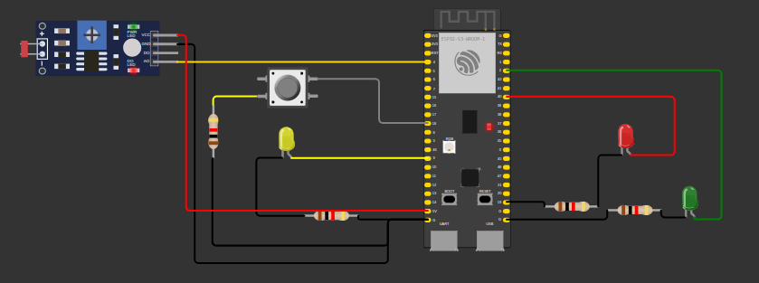

# Semaforo-Inteligente
Semáforo desenvolvido para a entrega da prova prático do módulo 4

### Montagem no simulador

Imagem demonstrando a montagem física do semáforo inteligente:

As principais alterações consistem em:

- Conectar o pino do ESP32 ao pino A0 do sensor de luminosidade, removendo o pino do D0, uma vez que, para o protótipo, precisamos dos dados analógicos.
- Conectar o pino VCC do sensor de luminosidade ao pino 5V do ESP32 para alimentação do sensor
- Conectar o resistor do led amarelo ao GND
- Remoção do jumper que conectava o botão ao reset (RST)
- Alteração da perna do botão ao qual o jumper conectado ao pino 18 do ESP32 estava conectado.

### Código

O código está disponível no arquivo <a href="sketch.ino">sketch.ino</a>

Casos de teste contemplados:

- Todas as entradas e saídas devem estar declaradas corretamente na inicialização
- Todos os leds devem estar apagados na inicialização
- Quando estiver escuro (segundo a leitura analógica do sensor LDR), o protótipo deve ativar o modo noturno e piscar o led amarelo a cada segundo
- Quando estiver claro (segundo a leitura analógica do sensor LDR), o protótipo deve ativar o modo convencional e fazer a temporização alternando entre verde (3 segundos), amarelo (2 segundos) e vermelho (5 segundos)
- Quando estiver claro (segundo a leitura analógica do sensor LDR) e o semáforo estiver no estado fechado (somente led vermelho aceso) e o botão for pressionado, o semáforo deve abrir 1 segundo após o pressionamento do botão
- O protótipo deve suportar debounce na leitura do botão 
- Quando estiver claro (segundo a leitura analógica do sensor LDR) e o semáforo estiver no estado fechado (somente led vermelho aceso) e o botão for pressionado 3 vezes, você deve enviar uma requisição HTTP para implementar um alerta (realize uma requisição para o http://www.google.com.br/ para fins de teste)

### OBSERVAÇÃO

Devido a sobrecarga no Wokwi, não consegui rodar e testar o programa, assim como não foi possível conectar ao WiFi.

Erro de sobrecarga:

Erro de WiFi:

